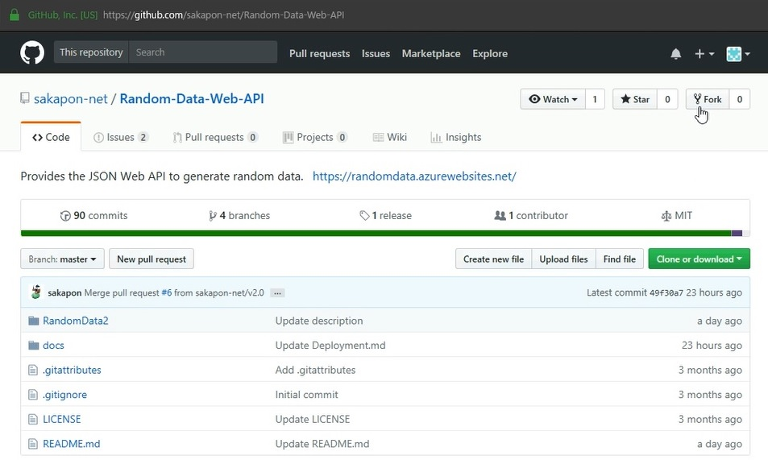

## デプロイ

### Azure Web App にデプロイする手順
GitHub にサインインして、このリポジトリを fork します。  
(Azure Web App と連携させるには、自身で所有しているリポジトリでなければならないためです。)

次に、Azure で Web App を作成します。

Web App の作成が完了したら、[デプロイ オプション] を構成します。  
ソースとして GitHub を選択すると、アカウント承認の画面が現れます。さらにリポジトリとブランチを選択します。

必要な設定はこれだけです。設定完了と同時に、ビルドおよびデプロイが開始されます。  
デプロイが完了すれば Web API が利用可能となります。

継続的デプロイが構成されるため、これ以降も fork したリポジトリを更新すれば、自動的にビルドおよびデプロイが実行されます。

### アプリケーション設定
- [アプリケーション設定](AppSettings.md)

### 参照
- [Azure と GitHub で継続的デプロイ (2017)](https://sakapon.wordpress.com/2017/12/30/azure-github-2017/)
