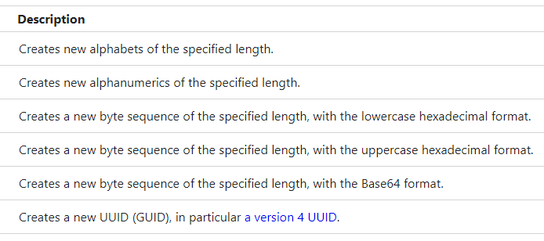

# Random Data Web API
ランダムなデータを生成するための JSON Web API を提供します。  
この Web API は CORS (Cross-Origin Resource Sharing) をサポートしています。

PaaS を利用して、この Web API を簡単にホストすることができます。
例えば、このリポジトリを fork すれば、Microsoft Azure Portal を利用して Web API を Azure Web App に直接デプロイできます。
またこの場合は継続的デプロイが構成され、fork したリポジトリが更新されれば Azure Web App も自動的に更新されます。

- [ホスティングについて](Hosting.md)
- [Azure Web App にデプロイする手順](Deployment.md)
- [アプリケーション設定](AppSettings.md)

## ランダム データの種類
- アルファベット
- アルファベットと数字
- バイト列
- UUID (GUID)
- 時刻順の ID

## Web アプリケーション
このプロジェクトは実際には ASP.NET Web アプリケーションであり、以下が含まれています。
- Web API
- 仕様が記述されたヘルプページ
- jQuery を利用したテストページ

[randomdata.azurewebsites.net](https://randomdata.azurewebsites.net/) は配置例です。

## ヘルプページの多言語対応
ブラウザーの翻訳機能で何とかなるでしょう。

